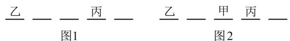

> [!faq]- 《第1节 排列与组合》参考答案
>
> > [!success]- **【答案】** B
>
> > [!note]- **【分析】**
> > 本题未单列分析。
>
> > [!note]- **【解析】**
> > B
> >
> > 解法1：由于乙、丙之间恰有2人，所以乙和丙可以站在第1，4位，也可以站在第2，5位，故可按此分别考虑，假设有甲、乙、丙、丁、戊五人，若乙、丙站在第1，4位，则乙、丙有 $\mathrm{A}_2^2$ 种排法，排好后如图1，接下来由于甲不在两端，所以甲只能排在乙、丙之间的两个位置，有 $\mathrm{A}_2^1$ 种排法，排好后如图2，剩下的丁和戊可以随意站，有 $\mathrm{A}_2^2$ 种排法，所以这一类共有 $\mathrm{A}_2^2\mathrm{A}_2^1\mathrm{A}_2^2 = 8$ 种排法；同理，当乙、丙站在第2，5位时，也有8种排法，所以不同的排法共有 $8 + 8 = 16$ 种.
> >
> > 解法2：由于乙、丙之间恰有2人，所以这2人中必有1人是甲，否则甲会站在两端，与题意不符，故也可先把乙、丙以及他们中间的两人排好，再排最后的剩下的1个人，
> >
> > 假设有甲、乙、丙、丁、戊五人，先把乙、丙两人排好，有 $\mathrm{A}_2^2$ 种排法；再从丁、戊中选1人，和甲一起排到乙丙之间，有 $\mathrm{C}_2^1\mathrm{A}_2^2$ 种排法；最后排剩下的人，可以排在上述4人的左边或右边，有 $\mathrm{A}_2^1$ 种排法；
> >
> > 由分步乘法计数原理，不同的排法共有 $\mathrm{A}_2^2\mathrm{C}_2^1\mathrm{A}_2^2\mathrm{A}_2^1 = 16$ 种.
> >
> > 
