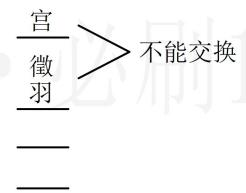

> [!faq]- 《第1节 排列与组合》参考答案
>
> > [!success]- **【答案】** 24
>
> > [!note]- **【分析】**
> > 本题未单列分析。
>
> > [!note]- **【解析】**
> > 解析：元素必须相邻用捆绑法，先把徵、羽捆绑在一起，看成一个音阶，与其余3个音阶一起排列，如图，有4个位置，由于捆绑后的徵、羽都在宫之后，所以先排它们，从4个位置中任选2个位置即可，有 $\mathrm{C}_4^2$ 种选法，
> >
> > 把宫和徵、羽排到选出的两个位置上去只有1种方法，不能交换，徵、羽内部可交换顺序，有 $\mathrm{A}_2^2$ 种方法，
> >
> > 最后再排商、角，有 $\mathrm{A}_2^2$ 种排法，由分步乘法计数原理，可排成不同的音序的种数为 $\mathrm{C}_4^2\mathrm{A}_2^2\mathrm{A}_2^2 = 24$
> >
> > 
