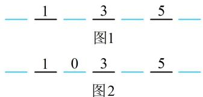

> [!faq]- 《第1节 排列与组合》参考答案
>
> > [!success]- **【答案】** B
>
> > [!note]- **【分析】**
> > 本题未单列分析。
>
> > [!note]- **【解析】**
> > 解析：涉及元素不相邻，考虑用插空法，如图1，先把3个奇数数字排好，有 $A_{3}^{3}$ 种排法，排好后产生4个空位，将剩下的0，2，4三个偶数数字插到这4个空位中，需注意，0不能在最高位，所以先把0插空，有3个空位可选，所以0的排法有 $A_{3}^{1}$ 种，0排好后如图2，剩下的数字2和4可从余下的3个空位中任选2个插空，有 $A_{3}^{2}$ 种插法，由分步乘法计数原理，满足条件的六位数共有 $A_{3}^{3}A_{3}^{1}A_{3}^{2}=$ 108个.
> >
> > 
