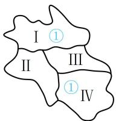
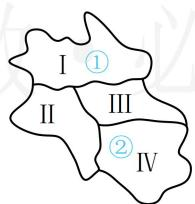
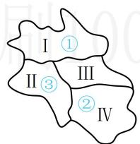

> [!faq]- 《第1节 排列与组合》参考答案
>
> > [!success]- **【答案】** 180
>
> > [!note]- **【分析】**
> > 本题未单列分析。
>
> > [!note]- **【解析】**
> > 解析：涂色问题用“跳格分类”处理，观察地图发现I和IV属跳格，故讨论它们同色和不同色两种情况，
> >
> > 不妨将5种颜色记作①，②，③，④，⑤，若I和IV同色，则它们有 $C_{5}^{1}$ 种涂法，涂好后如图1，再涂Ⅱ，有 $C_{4}^{1}$ 种涂法，涂好后如图2，最后的Ⅲ有 $C_{3}^{1}$ 种涂法，所以这一类共有 $C_{5}^{1}C_{4}^{1}C_{3}^{1}=60$ 种涂法；
> >
> > 若I和IV不同色，则它们有 $\mathrm{A}_5^2$ 种涂法，涂好后如图3，再涂II，有 $\mathbf{C}_3^1$ 种涂法，涂好后如图4，最后的III有 $\mathbf{C}_2^1$ 种涂法，所以这一类共有 $\mathrm{A}_5^2\mathrm{C}_3^1\mathrm{C}_2^1 = 120$ 种涂法；
> >
> > 综上所述，全部的涂法共有 $60 + 120 = 180$ 种.
> >
> >   
> > 图1
> >
> > 
> >
> >   
> > 图3
> >
> > 图2  
> >   
> > 图4
