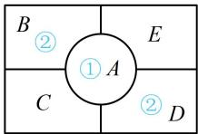
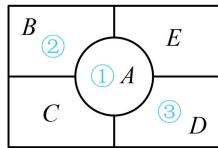

> [!faq]- 《第1节 排列与组合》参考答案
>
> > [!success]- **【答案】** 420
>
> > [!note]- **【分析】**
> > 本题未单列分析。
>
> > [!note]- **【解析】**
> > 解析：注意到 $A$ 与 $B, C, D, E$ 都相邻，所以先装扮 $A, A$ 用过的，其它几块都不能用了，
> >
> > 记五种不同的花卉分别为①，②，③，④，⑤，由题意，A 有 $C_{5}^{1}$ 种装扮方法，再来看 B, C, D, E，此时可用 “跳格分类” 处理，B, D 属跳格，不妨对它们分类，
> >
> > 若 $B$ ， $D$ 装扮相同的花卉，则 $B$ ， $D$ 有 $\mathrm{C}_4^1$ 种，
> >
> > 如图 1, 接下来 $C$ , $E$ 各自有 $\mathrm{C}_{3}^{1}$ 种装扮方法,
> >
> > 所以这一类共有 $\mathrm{C}_5^1\mathrm{C}_4^1\mathrm{C}_3^1\mathrm{C}_3^1 = 180$ 种装扮方法；
> >
> > 若 $B$ ， $D$ 装扮不同的花卉，则 $B$ ， $D$ 有 $\mathrm{A}_4^2$ 种，
> >
> > 如图2，接下来 $C$ ， $E$ 各自有 $\mathrm{C}_2^1$ 种装扮方法，
> >
> > 所以这一类共有 $\mathrm{C}_5^1\mathrm{A}_4^2\mathrm{C}_2^1\mathrm{C}_2^1 = 240$ 种装扮方法；
> >
> > 综上所述，不同的装扮方法共有 $180 + 240 = 420$ 种.
> >
> >   
> > 图1
> >
> >   
> > 图2
