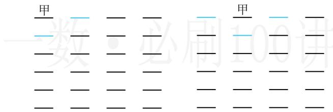
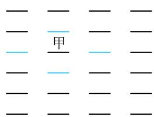

> [!faq]- 《第1节 排列与组合》参考答案
>
> > [!success]- **【答案】** 476
>
> > [!note]- **【分析】**
> > 本题未单列分析。
>
> > [!note]- **【解析】**
> > 解析：可先安排甲的座位，再看乙有几种坐法，按照与之相邻的座位个数，可把位置分三类，
> > - **①**：若甲坐在四个角落，则甲有 $\mathrm{A}_4^1$ 种坐法，如图1，甲坐好后，乙有3个位置不能坐（含甲已坐的位置），所以乙有 $\mathrm{A}_{21}^{1}$ 种坐法，故这一类有 $\mathrm{A}_4^1\mathrm{A}_{21}^1 = 84$ 种；
> > - **②**：若甲坐考场外围除去四个角落的位置，则甲有 $\mathrm{A}_{12}^{1}$ 种坐法，如图2，甲坐好后，乙有4个位置不能坐（含甲已坐的位置），所以乙有 $\mathrm{A}_{20}^{1}$ 种坐法，故这一类有 $\mathrm{A}_{12}^{1}\mathrm{A}_{20}^{1} = 240$ 种；
> > - **③**：若甲坐中间的这些位置，则甲有 $\mathrm{A}_8^1$ 种坐法，如图3，甲坐好后，乙有5个位置不能坐（含甲已坐的位置），所以乙有 $\mathrm{A}_{19}^{1}$ 种坐法，故这一类有 $\mathrm{A}_8^1\mathrm{A}_{19}^1 = 152$ 种；
> >
> > 由分类加法计数原理，满足题意的坐法共有 $84 + 240 + 152 = 476$ 种.
> >
> >   
> > 图1
> >
> >   
> > 图2  
> > 图3
