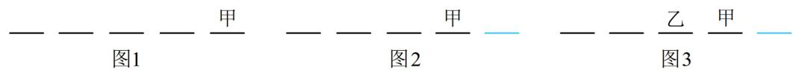

> [!faq]- 《第1节 排列与组合》例题解析
>
> > [!success]- **【答案】** 78
>
> > [!note]- **【分析】**
> > 本题未单列分析。
>
> > [!note]- **【解析】**
> > 解析：甲乙都是有特殊要求的元素，可优先考虑他们，不妨先考虑甲，甲站中间几个位置和站最右边的位置，对乙的排位有不同影响，故分类，
> > - **①**：若甲站最右边，如图1，则乙的限制条件必定满足，剩下4人可任意排，这一类有 $A_{4}^{4}=24$ 种排法；
> > - **②**：若甲不站最右边，则甲只能站中间3个位置，有 $A_{3}^{1}$ 种排法，甲排好后如图2，
> >
> > 此时由于乙也是有特殊要求的元素，且他的要求尚未满足，故接下来又考虑乙，
> >
> > 乙不能排最右边，所以乙有 $\mathrm{A}_3^1$ 种排法，乙排好后如图3，余下的3个位置可随便排了，有 $\mathrm{A}_3^3$ 种排法，故这一类共有 $\mathrm{A}_3^1\mathrm{A}_3^1\mathrm{A}_3^3 = 54$ 种排法；由分类加法计数原理，不同的站法有 $24 + 54 = 78$ 种.
> >
> >
> > 
>
> > [!tip]- **【总结】**
> > 在计数问题中，若某些元素有特殊要求，往往优先考虑这些有特殊要求的元素，再考虑其它元素.
