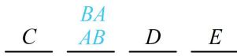

> [!faq]- 《第1节 排列与组合》例题解析
>
> > [!success]- **【答案】** 48
>
> > [!note]- **【分析】**
> > 本题未单列分析。
>
> > [!note]- **【解析】**
> > 解析：元素相邻用捆绑法, $A$ 和 $B$ 必须相邻, 将其捆绑看成 1 个人, 与其它 3 人一起排列, 有 $\mathrm{A}_{4}^{4}$ 种; 捆绑的 $A$ 和 $B$ 彼此可交换顺序, 如图, 交换的方法有 $\mathrm{A}_{2}^{2}$ 种, 所以全部的站法有 $\mathrm{A}_{4}^{4} \mathrm{~A}_{2}^{2}=48$ 种. $\underline{C} \quad \underline{AB} \quad \underline{D} \quad \underline{E}$
> >
> >
> > 
