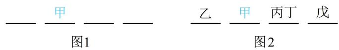

> [!faq]- 《第1节 排列与组合》例题解析
>
> > [!success]- **【答案】** B
>
> > [!note]- **【分析】**
> > 本题未单列分析。
>
> > [!note]- **【解析】**
> > A. 12 种 B. 24 种 C. 36 种 D. 48 种
> >
> > 解析：丙和丁相邻，将其捆绑看成1人，与剩下3人一起排列，排列时由于甲不站两端，先考虑甲，如图1，甲在中间两个位置选1个，有 $A_{2}^{1}$ 种排法，剩下3人（丙丁看成1人）有 $A_{3}^{3}$ 种排法，如图2，丙丁彼此可交换，交换的方法有 $A_{2}^{2}$ 种，由分步乘法计数原理，不同排列方式共有 $A_{2}^{1}A_{3}^{3}A_{2}^{2}=24$ 种.
> >
> >
> > 
>
> > [!tip]- **【总结】**
> > 某些元素必须相邻的排列问题，可将必须相邻的元素捆绑在一起，看成一个元素，与其它元素进行排列，但需注意，捆在一起的元素内部可交换顺序.
