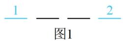
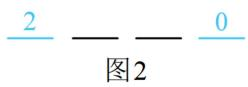
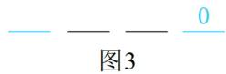
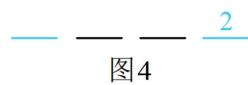

> [!faq]- 《第1节 排列与组合》例题解析
>
> > [!success]- **【答案】** 420
>
> > [!note]- **【分析】**
> > 本题未单列分析。
>
> > [!note]- **【解析】**
> > 解法 1: 由于是四位偶数, 所以除了 0 不能排最高位之外, 还有最低位应为偶数数字, 可先考虑最高位, 最高位排奇数数字, 还是偶数数字, 对接下来最低位的安排有影响, 故应分类,
> > - **①**：若最高位排奇数数字，则可从1，3，5中选1个排在最高位，有 $\mathrm{A}_3^1$ 种排法，
> >
> > 再考虑最低位，可从0，2，4，6中选1个排在最低位，有 $\mathrm{A}_4^1$ 种排法，排好后如图1，
> >
> > 中间的两个位置可任意排，有 $\mathrm{A}_5^2$ 种排法，故这一类共有 $\mathrm{A}_3^1\mathrm{A}_4^1\mathrm{A}_5^2 = 240$ 种；
> > - **②**：若最高位排偶数数字，则可从2，4，6中选1个排在最高位，有 $\mathrm{A}_3^1$ 种排法，
> >
> > 再考虑最低位，偶数数字已用掉一个，可从余下的3个中选1个排最低位，有 $\mathrm{A}_3^1$ 种排法，排好后如图2，中间的两个位置可任意排，有 $\mathrm{A}_5^2$ 种排法，故这一类共有 $\mathrm{A}_3^1\mathrm{A}_3^1\mathrm{A}_5^2 = 180$ 种；
> >
> > 由分类加法计数原理，满足条件的四位偶数共有 $240 + 180 = 420$ 个.
> >
> > 解法2：也可以先考虑最低位，最低位排0和排其他偶数，对接下来最高位的影响不同，故应分类，
> > - **①**：若最低位是 0，如图 3，其他三位可任意排，故这一类有 $A_{6}^{3}=120$ 种；
> > - **②**：若最低位不是0，则最低位可从2，4，6中选1个排上去，有 $A_{3}^{1}$ 种排法，排好后如图4，接下来最高位不能是0，故又考虑最高位，0和最低位已排的数字不能用，还剩5个数字，有 $A_{5}^{1}$ 种排法，中间2位可从余下的5个数字中任选2个排上去，有 $A_{5}^{2}$ 种排法，故这一类有 $A_{3}^{1}A_{5}^{1}A_{5}^{2}=300$ 种；
> >
> > 由分类加法计数原理，满足条件的四位偶数共有 $120 + 300 = 420$ 个.
> >
> >
> > 
> >
> > 
> >
> > 
> >
> > 
