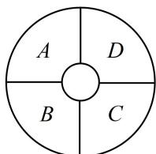

<!-- question-source:start -->
【例 8】如图, 一环形花坛分成 $A$ , $B$ , $C$ , $D$ 四块, 现有 4 种不同的花可供选择, 要求在每块里种 1 种花, 相邻的两块种不同的花, 则不同的种法总数为 \_\_\_\_.

<!-- question-source:end -->

![[高中/总复习/教辅/一数常规版2026/第11章 计数原理/模块1 排列与组合/第1节 排列与组合/类型07_染色问题/例题/answers/Q00049562A1.md]]
