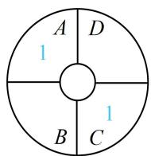
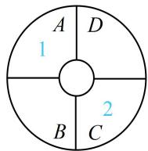

> [!faq]- 《第1节 排列与组合》例题解析
>
> > [!success]- **【答案】** 84
>
> > [!note]- **【分析】**
> > 本题未单列分析。
>
> > [!note]- **【解析】**
> > 解析：为了便于阐述，我们将4种花编号为1，2，3，4，不妨先种 $A$ 这一块，有 $\mathrm{C}_4^1$ 种种法，
> >
> > 接下来种哪块呢？由于 $C$ 和 $A$ 种相同的花或不同的花，接下来 $B, D$ 的考虑方法有区别，故对 $C$ 分类，若 $C$ 与 $A$ 种相同的花，如图1，则 $C$ 有1种种法，而 $B, D$ 各自都可从余下的3种花中选一种来种，
> >
> > 所以 $B, D$ 都有 $\mathrm{C}_3^1$ 种种法，结合 $A$ 有 $\mathrm{C}_4^1$ 种种法知这一类共有 $\mathrm{C}_4^1\mathrm{C}_3^1\mathrm{C}_3^1 = 36$
> >
> > 种不同的种法;
> >
> > 若 $C$ 与 $A$ 种不同的花，如图2，则 $C$ 有 $\mathrm{C}_3^1$ 种种法，
> >
> > 而 $B, D$ 各自都可从余下的2种花中选一种来种，
> >
> > 所以 B, D 都有 $C_{2}^{1}$ 种种法，故这一类共有 $C_{4}^{1}C_{3}^{1}C_{2}^{1}C_{2}^{1}=48$ 种不同的种法；
> >
> > 由分类加法计数原理，不同的种法总数为 $36 + 48 = 84$ 种.
> >
> > 
> >
> >   
> > 图1  
> > 图2
>
> > [!tip]- **【反思】**
> > 染色问题常采用 “跳格分类” 的方法处理, 例如本题中 $A$ , $C$ 之间跳了一格, 故可按 $A$ , $C$ 相同和 $A$ , $C$ 不同分类, 再来考虑 $B$ , $D$ .
