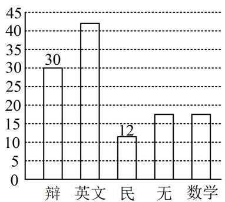
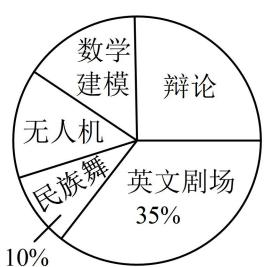

<!-- question-source:start -->
7. (2023·广东模拟·★★)(多选)

某学校组建了辩论、英文剧场、民族舞、无人机和数学建模五个社团，高一学生全员参加，且每位学生只能参加一个社团。学校根据学生参加情况绘制如下统计图，已知无人机社团和数学建模社团的人数相等。下列说法正确的是（）  
A. 高一年级学生人数为 120 人  
B. 无人机社团的学生人数为 17 人  
C. 若按比例分层抽样从各社团选派 20 人，则无人机社团选派人数为 3 人  
D. 若甲、乙、丙三人报名参加社团，则共有 60 种不同的报名方法

<!-- question-source:end -->

![[Q00049626A1]]
