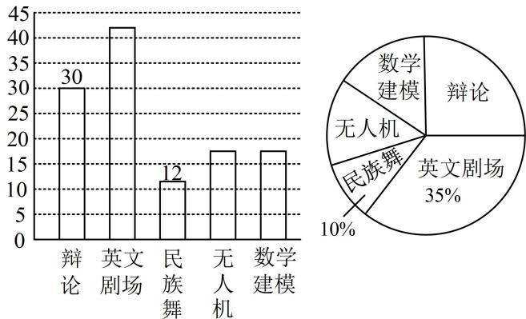

> [!faq]- 《第1节 抽样》参考答案
>
> > [!success]- **【答案】** 700
>
> > [!note]- **【分析】**
> > 本题未单列分析。
>
> > [!note]- **【解析】**
> > 解析：因为是按比例分层抽取，所以可由各层的抽取率相等来建立方程，
> >
> > 设 $C$ 产品共有 $x$ 件，抽取了 $y$ 件，则 $A$ 产品共有
> >
> > $3000 - x - 1500 = 1500 - x$ 件，抽取了 $y + 10$ 件，
> >
> > 所以 $\frac{y + 10}{1500 - x} = \frac{150}{1500} = \frac{y}{x}$ ，解得： $x = 700$ ， $y = 70$ ，
> >
> > 所以 C 产品的数量是 700 件.
> >
> > 某学校组建了辩论、英文剧场、民族舞、无人机和数学建模五个社团，高一学生全员参加，且每位学生只能参加一个社团。学校根据学生参加情况绘制如下统计图，已知无人机社团和数学建模社团的人数相等。下列说法正确的是（ ）A. 高一年级学生人数为120人B. 无人机社团的学生人数为17人C. 若按比例分层抽样从各社团选派20人，则无人机社团选派人数为3人D. 若甲、乙、丙三人报名参加社团，则共有60种不同的报名方法
> >
> > 
