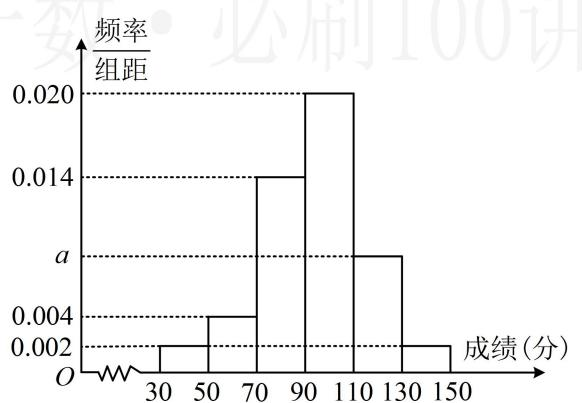

<!-- question-source:start -->
1.（2023·江苏模拟·★★）（多选）

某校 1000 名学生在高三一模测试中数学成绩的频率分布直方图如图所示（同一组中的数据用该组区间的中点值作代表），分数不低于 X 即为优秀，已知优秀学生有 80 人，则（）

A. a = 0.008

B. X = 120

C. 70 分以下的人数约为 6 人

D. 本次考试的平均分约为 93.6

<!-- question-source:end -->

![[Q00049641A1]]
