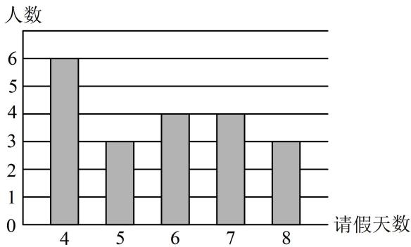

<!-- question-source:start -->
2. (2024·广东模拟·★★)(多选)

某部门30名员工一年中请假天数（未请假则请假天数为0）与对应人数的柱形图（图中只有请假天数为0的未显示）如图所示，则（）

A. 该部门一年中请假天数为0的人数为10  
B. 该部门一年中请假天数大于5的人数为10  
C. 这30名员工一年中请假天数的第40百分位数为4  
D. 这30名员工一年中请假天数的平均数小于4
<!-- question-source:end -->

![[Q00049642A1]]
