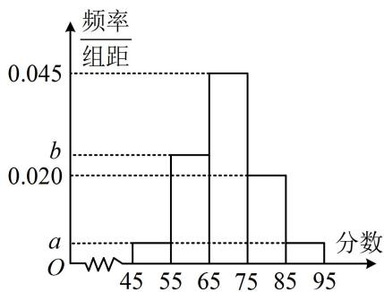

<!-- question-source:start -->
## 10. (2022·上海模拟改·★★)

某高校承办了奥运会的志愿者选拔面试工作，现随机抽取了100名候选者的面试成绩并分成五组：[45,55)，[55,65)，[65,75)，[75,85)，[85,95]，绘制成如图所示的频率分布直方图，已知第三、四、五组的频率之和为0.7，第一组和第五组的频率相同.

（1）求图中 $a, b$ 的值；

（2）估计这100名候选者面试成绩的平均数、方差和第60百分位数（精确到0.1）.参考数据： $69.5^{2} = 4830.25$
<!-- question-source:end -->

![[Q00049650A1]]
