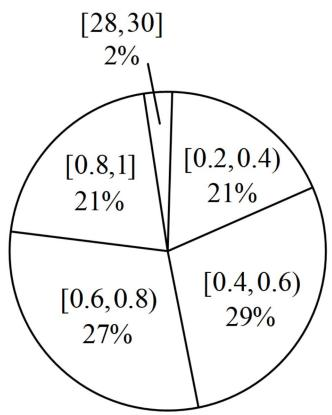
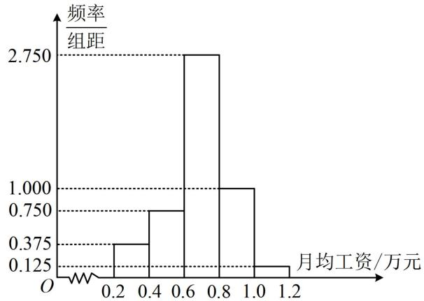

<!-- question-source:start -->
## 11. (2022·全国模拟·★★★)

已知 $A$ ， $B$ 两家公司的员工月均工资（单位：万元）的情况分别如图1，图2所示：

  
图1

  
图2

（1）以每组数据的区间中点值为代表，根据图1估计 $A$ 公司员工月均工资的平均数、中位数，你认为哪个数据更能反映该公司普通员工的工资水平？请说明理由；

(2) 小明拟到 $A, B$ 两家公司中的一家应聘，以公司普通员工的工资水平作为决策依据，他应该选哪家公司？

## 一数·必刷100讲
<!-- question-source:end -->

![[Q00049651A1]]
