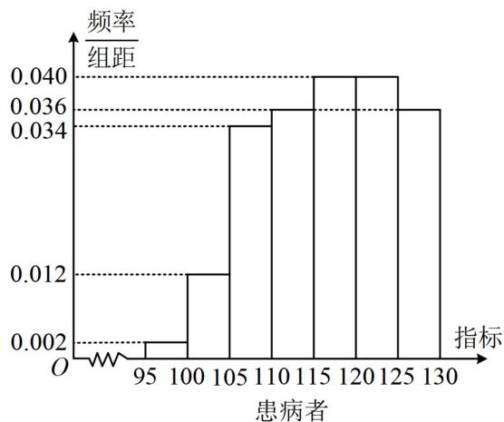
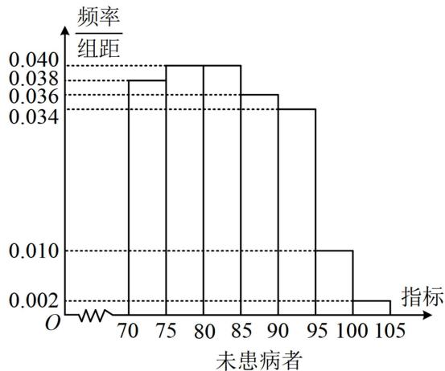

<!-- question-source:start -->
## 13. (2023·新课标Ⅱ卷·★★★)

某研究小组经过研究发现某种疾病的患病者与未患病者的某项医学指标有明显差异，经过大量调查，得到如下的患病者和未患病者该项指标的频率分布直方图：

利用该指标制定一个检测标准，需要确定临界值 $c$ ，将该指标大于 $c$ 的人判定为阳性，小于或等于 $c$ 的人判定为阴性．此检测标准的漏诊率是将患病者判定为阴性的概率，记为 $p(c)$ ；误诊率是将未患病者判定为阳性的概率，记为 $q(c)$ ．假设数据在组内均匀分布．以事件发生的频率作为相应事件发生的概率.

（1）当漏诊率 $p(c) = 0.5\%$ 时，求临界值 $c$ 和误诊率 $q(c)$ ；

（2）设函数 $f(c) = p(c) + q(c)$ 。当 $c \in [95,105]$ 时，求 $f(c)$ 的解析式，并求 $f(c)$ 在区间[95,105]的最小值.
<!-- question-source:end -->

![[Q00049653A1]]
