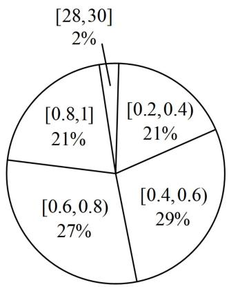
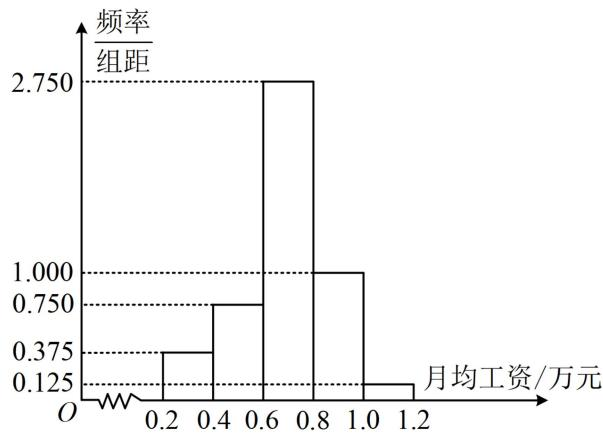

> [!faq]- 《第2节 用样本估计总体》参考答案
>
> > [!success]- **【答案】** 详见解析
>
> > [!note]- **【分析】**
> > 本题未单列分析。
>
> > [!note]- **【解析】**
> > ## 11. (2022·全国模拟·★★★)
> >
> > 已知 $A$ ， $B$ 两家公司的员工月均工资（单位：万元）的情况分别如图1，图2所示：
> >
> >   
> > 图1
> >
> >   
> > 图2
> >
> > （1）以每组数据的区间中点值为代表，根据图1估计 $A$ 公司员工月均工资的平均数、中位数，你认为哪个数据更能反映该公司普通员工的工资水平？请说明理由；
> >
> > (2) 小明拟到 $A, B$ 两家公司中的一家应聘，以公司普通员工的工资水平作为决策依据，他应该选哪家公司？
