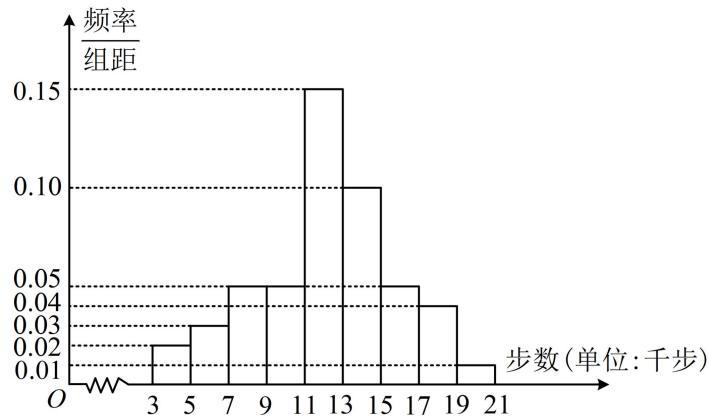

<!-- question-source:start -->
【例 1】某地区工会利用 “健步行 APP” 开展健步走活动。为了解会员的健步走情况，工会在某天从系统中抽取了 1000 名会员，统计了当天他们的步数（千步为单位），并将样本数据分为 [3,5)，[5,7)，[7,9)，…，[17,19)，[19,21] 九组，整理得到如图所示的频率分布直方图，则当天这 1000 名会员中步数少于 11 千步的人数为（） A. 100 B. 200 C. 260 D. 300

<!-- question-source:end -->

![[高中/总复习/教辅/一数常规版2026/第12章 概率统计/模块1 统计/第2节 用样本估计总体/类型01_由频率分布直方图计算频率_频数/例题/answers/Q00049628A1.md]]
