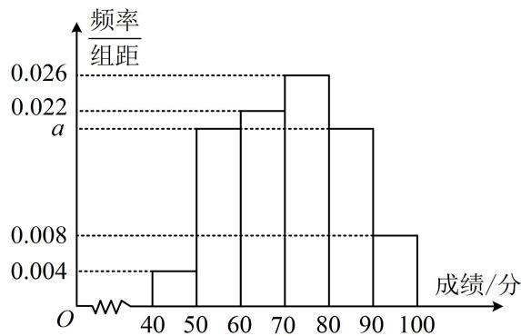

<!-- question-source:start -->
【变式】如图是一学校期末考试中某班物理成绩的频率分布直方图，数据的分组依次为[40,50)，[50,60)，[60,70)，[70,80)，[80,90)，[90,100]，若成绩不低于70分的人数比成绩低于70分的人数多4人，则 $a =$ \_\_\_\_；该班的学生人数为\_\_\_\_。

<!-- question-source:end -->

![[高中/总复习/教辅/一数常规版2026/第12章 概率统计/模块1 统计/第2节 用样本估计总体/类型01_由频率分布直方图计算频率_频数/例题/answers/Q00049629A1.md]]
