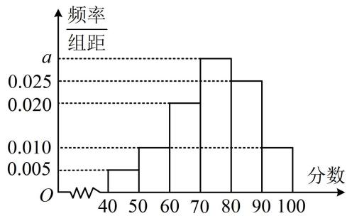

<!-- question-source:start -->
【变式 2】凯里市 2020 年被评为全国文明城市，为了巩文固卫，凯里一中某研究性学习小组举办了“文明城市”知识竞赛，从所有答卷中随机抽取 400 份试卷作为样本，将样本的成绩（满分 100 分，成绩均为不低于 40 分的整数）分成 6 段：[40,50)，[50,60)，…，[90,100]，得到如图所示的频率分布直方图，则 $a=$ \_\_\_\_；由图可估计知识竞赛的第 80 百分位数为 \_\_\_\_.

<!-- question-source:end -->

![[高中/总复习/教辅/一数常规版2026/第12章 概率统计/模块1 统计/第2节 用样本估计总体/类型02_百分位数的计算/例题/answers/Q00049632A1.md]]
