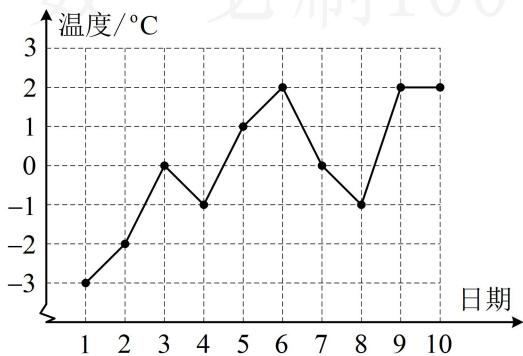

> [!faq]- 《第2节 用样本估计总体》例题解析
>
> > [!success]- **【答案】** C
>
> > [!note]- **【分析】**
> > 本题未单列分析。
>
> > [!note]- **【解析】**
> > A. $2^{\circ}$ C B. $-1^{\circ}$ C C. $-0.5^{\circ}$ C D. $-2^{\circ}$ C
> >
> > 
> >
> > 解析：计算百分位数，先把数据按照由小到大的顺序排列，再计算 $i=n\times p\%$ ，看i是否为整数，
> > 由折线图可知这10天的最低气温按照从低到高的顺序排列为-3，-2，-1，-1，0，0，1，2，2，2，
> > 而 $10\times40\%=4$ ，i为整数，故取第4项和第5项数据的平均值作为第40百分位数，
> > 所以这10天的最低气温的第40百分位数是 $\frac{-1+0}{2}=-0.5^{\circ}C$ .
