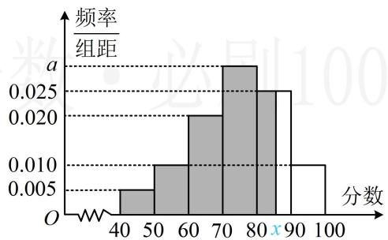

> [!faq]- 《第2节 用样本估计总体》例题解析
>
> > [!success]- **【答案】** 0.03；86
>
> > [!note]- **【分析】**
> > 本题未单列分析。
>
> > [!note]- **【解析】**
> > 解析：由图可知， $10 \times 0.005 + 10 \times 0.01 + 10 \times 0.02 + 10 \times a + 10 \times 0.025 + 10 \times 0.01 = 1$ ，解得：a = 0.03；
> > 由频率分布直方图估计第 p 百分位数，就是要在频率分布直方图中找到左侧小矩形面积和为 $p\%$ 的位置，由图可知前 4 组的面积之和 $1 - 10 \times 0.025 - 10 \times 0.01 = 0.65 < 0.8$ ，前 5 组的面积之和 $1 - 10 \times 0.01 = 0.9 > 0.8$ ，所以第 80 百分位数必定在区间 [80,90) 内，设为 x，
> >
> > 如图，由左侧阴影面积为 0.8 可得 $0.65 + (x - 80) \times 0.025 = 0.8$ ，解得：x = 86。
> >
> >
> > 
>
> > [!tip]- **【总结】**
> > - **①**：给出 $n$ 个数据, 让求第 $p$ 百分位数, 先将数据按从小到大的顺序排列, 再计算 $i = n \times p\%$ , 若 $i$ 为整数, 则取第 $i$ 个和第 $i + 1$ 个数据的平均值作为第 $p$ 百分位数, 若 $i$ 不是整数, 而比 $i$ 大的最小整数为 $j$ , 则取第 $j$ 个数据为第 $p$ 百分位数;
> > - **②**：由频率分布直方图估计第 $p$ 百分位数, 只需在频率分布直方图中找到左侧小矩形面积和为 $p\%$ 的位置即可.
