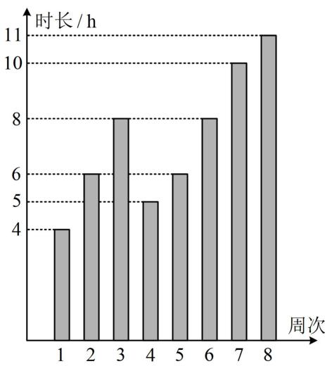
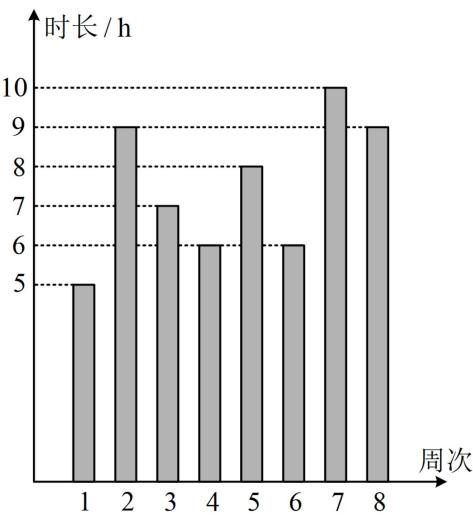

<!-- question-source:start -->
【例 3】甲、乙两位同学本学期前 8 周的各周课外阅读时长的条形统计图如图所示.

  
甲

  
乙

则下列结论正确的是（）
A. 甲同学周课外阅读时长的样本众数为8
B. 甲同学周课外阅读时长的样本中位数是5.5
C. 乙同学周课外阅读时长的样本平均数是7.5
D. 乙同学周课外阅读时长大于8的概率的估计值大于0.4
<!-- question-source:end -->

![[高中/总复习/教辅/一数常规版2026/第12章 概率统计/模块1 统计/第2节 用样本估计总体/类型03_平均数_中位数_众数的计算/例题/answers/Q00049633A1.md]]
