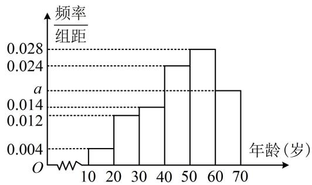

<!-- question-source:start -->
【例 4】非物质文化遗产（简称“非遗”）是优秀传统文化的重要组成部分，是一个国家和民族历史文化成就的重要标志。随着短视频这一新兴媒介形态的兴起，非遗传播获得广阔的平台，非遗文化迎来了发展的春天。为研究非遗短视频受众的年龄结构，现从各短视频平台随机调查了1000名非遗短视频的粉丝，记录他们的年龄，将数据分成6组：[10,20)，[20,30)，…，[50,60)，[60,70]，并整理得到如下的频率分布直方图：

(1) 求 a 的值;

(2) 在频率分布直方图中, 用每一个小矩形底边中点的横坐标作为该组粉丝年龄的平均数, 估计非遗短视频粉丝年龄的平均数 $m$ , 若中位数的估计值为 $n$ , 比较 $m$ 与 $n$ 的大小关系.
<!-- question-source:end -->

![[高中/总复习/教辅/一数常规版2026/第12章 概率统计/模块1 统计/第2节 用样本估计总体/类型03_平均数_中位数_众数的计算/例题/answers/Q00049634A1.md]]
