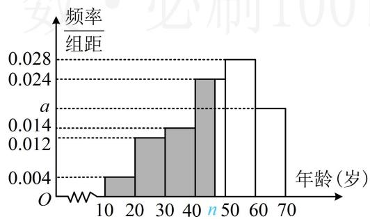

> [!faq]- 《第2节 用样本估计总体》例题解析
>
> > [!success]- **【答案】** 详见解析
>
> > [!note]- **【分析】**
> > 本题未单列分析。
>
> > [!note]- **【解析】**
> > 解：
> > （1）由图可知， $10 \times 0.004 + 10 \times 0.012 + 10 \times 0.014 + 10 \times 0.024 + 10 \times 0.028 + 10 \times a = 1$ ，解得：a = 0.018.
> > （2）由图可知，从左至右6组的频率依次为0.04，0.12，0.14，0.24，0.28，0.18，
> > 所以频数依次为40，120，140，240，280，180，
> > 故 $m=\frac{15\times40+25\times120+35\times140+45\times240+55\times280+65\times180}{1000}=46.4$
> >
> > 前3组的频率和 $0.04 + 0.12 + 0.14 = 0.3 < 0.5$ ，前4组的频率和 $0.04 + 0.12 + 0.14 + 0.24 = 0.54 > 0.5$ 所以中位数 $n$ 在[40,50)这一组，（如图，阴影部分面积应为0.5，前三组的面积已求出，第四组的左边阴影部分底边是 $n - 40$ ，高为0.024，其面积能用 $n$ 表示，故可由此建立方程求 $n$ ）从而 $0.3 + (n - 40)\times 0.024 = 0.5$ ，解得： $n = \frac{145}{3}\approx 48.3$ ，故 $m < n$
> >
> > 
>
> > [!tip]- **【反思】**
> > 由频率分布直方图估计样本数据的中位数，就是在频率分布直方图的横轴上找一个数，使不超过该数的频率和为0.5，求解时应先判断中位数位于哪一组，再列方程计算.
