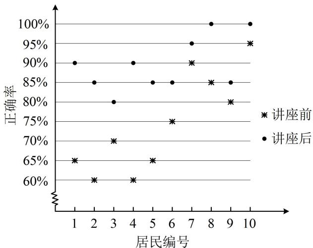

<!-- question-source:start -->
【例 5】(2022·全国甲卷) 某社区通过公益讲座来普及社区居民的垃圾分类知识, 随机抽取 10 位社区居民, 让他们在讲座前和讲座后各回答一份垃圾分类知识问卷, 这 10 位社区居民在讲座前和讲座后问卷答题的正确率如下图, 则 ( )

A. 讲座前问卷答题的正确率的中位数小于 $70\%$ B. 讲座后问卷答题的正确率的平均数大于 $85\%$ C. 讲座前问卷答题的正确率的标准差小于讲座后正确率的标准差

D. 讲座后问卷答题的正确率的极差大于讲座前正确率的极差

<!-- question-source:end -->

![[高中/总复习/教辅/一数常规版2026/第12章 概率统计/模块1 统计/第2节 用样本估计总体/类型04_方差_标准差的计算与分析/例题/answers/Q00049635A1.md]]
