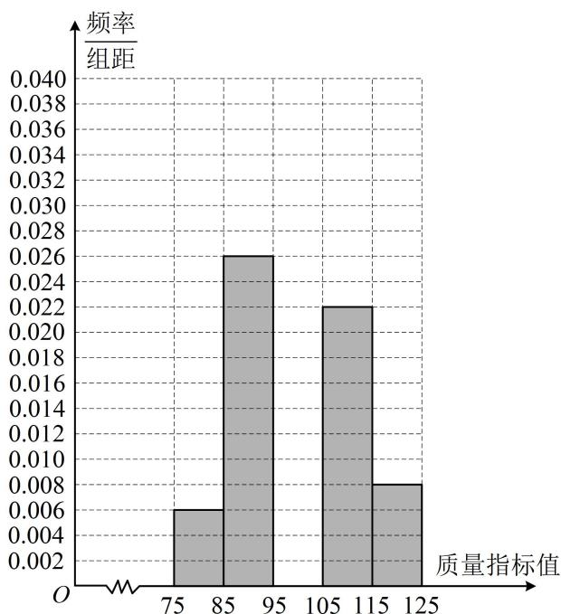

<!-- question-source:start -->
【例 7】从某企业生产的某种产品中抽取 100 件，测量这些产品的一项质量指标值，由测量数据得到频率分布直方图如图所示.

(1) 补全频率分布直方图;
<!-- question-source:end -->

![[高中/总复习/教辅/一数常规版2026/第12章 概率统计/模块1 统计/第2节 用样本估计总体/类型04_方差_标准差的计算与分析/例题/answers/Q00049639A1.md]]
