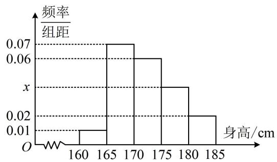

<!-- question-source:start -->
【变式】为了调查某中学高一年级学生的身高情况，在高一年级随机抽取100名学生作为样本，把他们的身高（单位：cm）按照区间[160,165)，[165,170)，[170,175)，[175,180)，[180,185]分组，得到样本身高的频率分布直方图如图所示.

（1）求频率分布直方图中 $x$ 的值以及样本中身高不低于 $175\mathrm{cm}$ 的学生人数；

（2）统计过程中，小明与小张两位同学因事缺席，测得其余98名同学的平均身高为 $172\mathrm{cm}$ ，方差为29，之后补测得到小明与小张的身高分别为 $171\mathrm{cm}$ 与 $173\mathrm{cm}$ ，试根据上述数据求样本的方差.
<!-- question-source:end -->

![[高中/总复习/教辅/一数常规版2026/第12章 概率统计/模块1 统计/第2节 用样本估计总体/类型04_方差_标准差的计算与分析/例题/answers/Q00049640A1.md]]
