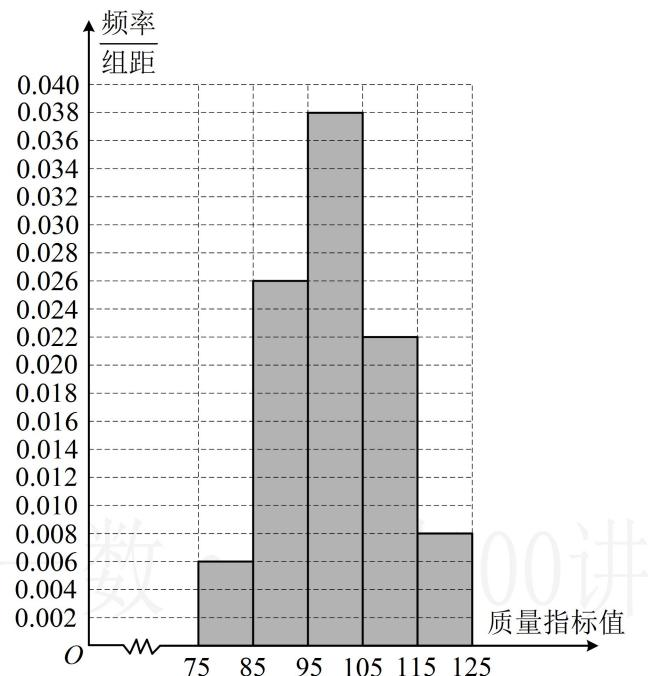

> [!faq]- 《第2节 用样本估计总体》例题解析
>
> > [!success]- **【答案】** 详见解析
>
> > [!note]- **【分析】**
> > 本题未单列分析。
>
> > [!note]- **【解析】**
> > (2) 若同一组数据用该组区间的中点值作代表, 试估计这种产品质量指标值的平均数 $\overline{x}$ 和方差 $s^2$ . 解:
> > (1) 由图可知数据落在[95,105)的频率为 $1 - 10 \times (0.006 + 0.026 + 0.022 + 0.008) = 0.38$ , 所以[95,105)这一组的高为0.038, 故补全后的频率分布直方图如图.
> >
> > （2）（由频率分布直方图估计样本平均数，用区间中点乘以对应的频率，再求和即可）由题意， $\overline{x} = 80\times 0.06 + 90\times 0.26 + 100\times 0.38 + 110\times 0.22 + 120\times 0.08 = 100$ ，
> >
> > （由频率分布直方图估计样本方差，可代公式 $s^2 = \sum_{i=1}^{n}(x_i - \overline{x})^2 f_i$ ，其中 $x_i$ 为各组区间中点， $f_i$ 为对应的频率） $s^2 = (80 - 100)^2 \times 0.06 + (90 - 100)^2 \times 0.26 + (110 - 100)^2 \times 0.22 + (120 - 100)^2 \times 0.08 = 104$ .
> >
> > 
>
> > [!tip]- **【反思】**
> > 在频率分布直方图中，设第 $i$ 组的区间中点为 $x_{i}$ ，频率为 $f_{i}$ ，其中 $i = 1,2,\dots ,n$ ，若每组数据用区间中点值作代表，则样本平均数 $\overline{x} = \sum_{i = 1}^{n}x_{i}f_{i}$ ，样本方差 $s^2 = \sum_{i = 1}^{n}(x_i - \overline{x})^2 f_i$ 。
