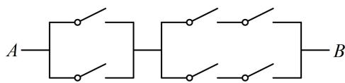

<!-- question-source:start -->
## 9. (2022·广东佛山模拟·★★★)

如图, 电路从 $A$ 到 $B$ 上共连接了 6 个开关, 每个开关闭合的概率都为 $\frac{2}{3}$ , 若每个开关是否闭合相互之间没有影响, 则从 $A$ 到 $B$ 通路的概率是 ( )  
A. $\frac{10}{27}$ B. $\frac{100}{243}$ C. $\frac{448}{729}$ D. $\frac{40}{81}$

<!-- question-source:end -->

![[Q00049678A1]]
