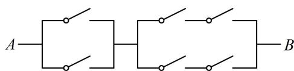
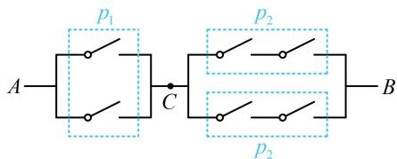

> [!faq]- 《第1节 随机事件的概率、事件的独立性》参考答案
>
> > [!success]- **【答案】** C
>
> > [!note]- **【分析】**
> > 本题未单列分析。
>
> > [!note]- **【解析】**
> > 如图，电路从 $A$ 到 $B$ 上共连接了 6 个开关，每个开关闭合的概率都为 $\frac{2}{3}$ ，若每个开关是否闭合相互之间没有影响，则从 $A$ 到 $B$ 通路的概率是（）
> > A. $\frac{10}{27}$ B. $\frac{100}{243}$ C. $\frac{448}{729}$ D. $\frac{40}{81}$
> >
> > 
> >
> > 解析：如图，把电路分成两部分，先看 $A$ 到 $C$ . 两个开关应至少闭合1个，可能的情况较多，但其对立事件只有两个开关都断开这一种情况，故考虑用对立事件求概率，从 $A$ 到 $C$ 通路的概率 $p_1 = 1 - \left(1 - \frac{2}{3}\right) \times \left(1 - \frac{2}{3}\right) = \frac{8}{9}$ ，
> >
> > 再看从 $C$ 到 $B$ ，又分完全相同的上、下两部分，要使从 $C$ 到 $B$ 通路，上、下应至少有一条是通路，仍用对立事件求概率，先计算上、下各自通路的概率，  
> > 从 $C$ 到 $B$ 上、下各自通路的概率 $p_2 = \frac{2}{3} \times \frac{2}{3} = \frac{4}{9}$ 所以从 $C$ 到 $B$ 通路的概率为 $1 - \left(1 - \frac{4}{9}\right) \times \left(1 - \frac{4}{9}\right) = \frac{56}{81}$ 而从 $A$ 到 $B$ 要通路，需 $A$ 到 $C$ ， $C$ 到 $B$ 均通路，
> >
> > 故所求概率 $P=\frac{8}{9}\times\frac{56}{81}=\frac{448}{729}$ .
> >
> > 
