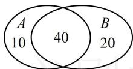

> [!faq]- 《第1节 条件概率公式、全概率公式》参考答案
>
> > [!success]- **【答案】** A
>
> > [!note]- **【分析】**
> > 本题未单列分析。
>
> > [!note]- **【解析】**
> > A
> >
> > 解法1：所求概率为条件概率，先设事件，再套公式，设某人报足球俱乐部为事件 $A$ ，报乒乓球俱乐部为事件 $B$ ，则所求概率为 $P(B|A) = \frac{P(AB)}{P(A)}$ ①，要算 $P(AB)$ 和 $P(A)$ ，需要 $n(AB)$ ， $n(A)$ 和 $n(\Omega)$ ，为了分析各部分构成，我们画图来看，如图， $n(AB) = 40$ ， $n(A) = 50$ ， $n(\Omega) = 70$ ，所以 $P(AB) = \frac{n(AB)}{n(\Omega)} = \frac{4}{7}$ ， $P(A) = \frac{n(A)}{n(\Omega)} = \frac{5}{7}$ 代入①得 $P(B|A) = 0.8$ ：
> >
> > 解法2：也可利用条件的直观意义，将报足球俱乐部的人作为新的样本空间来考虑。要计算所求概率，应先分析各部分的人数构成，题干的文字描述较抽象，我们画Venn图来看，
> >
> > 设报名足球俱乐部的 50 人构成集合 A，报名乒乓球俱乐部的 60 人构成集合 B，如图，报足球俱乐部的 50 人中有 40 人报乒乓球俱乐部，故所求概率 $P=\frac{40}{50}=0.8$ .
> >
> > 
