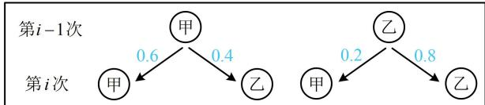

> [!faq]- 《第1节 条件概率公式、全概率公式》参考答案
>
> > [!success]- **【答案】** 详见解析
>
> > [!note]- **【分析】**
> > 本题未单列分析。
>
> > [!note]- **【解析】**
> > 解: (1) (第一次投篮的人可能是甲, 也可能是乙, 两种情
> >
> > 况下第二次投篮的人是乙的概率都是已知的，故按第一次投篮的人是谁划分样本空间，套用全概率公式）记第 $i(i = 1,2,3,\dots)$ 次投篮的人是甲为事件 $A_{i}$ ，第2次投篮的人是乙为事件 $B$ ，由全概率公式， $P(B) = P(A_{1})P(B|A_{1}) + P(\overline{A}_{1})P(B|\overline{A}_{1}) = 0.5 \times (1 - 0.6) + 0.5 \times 0.8 = 0.6$ .
> >
> > （2）（从第 $i - 1$ 次到第 $i$ 次的投篮情况，我们可画图辅助理解，如下图，第 $i - 1$ 次两种情况下第 $i$ 次投篮的人是甲的概率都已知，故根据第 $i - 1$ 次由谁投篮划分样本空间，套用全概率公式来建立递推公式）  
> > 当 $i\geq 2$ 时，由全概率公式， $P(A_{i}) = P(A_{i - 1})P(A_{i}\mid A_{i - 1})+$ $P(\overline{A}_{i - 1})P(A_i|\overline{A}_{i - 1}) = P(A_{i - 1})\times 0.6 + [1 - P(A_{i - 1})]\times 0.2,$ 整理得： $P(A_{i}) = \frac{2}{5} P(A_{i - 1}) + \frac{1}{5}$ ①，  
> > （要由此递推公式求 $P(A_{i})$ ，可用待定系数法构造等比数列.设 $P(A_{i}) + \lambda = \frac{2}{5} [P(A_{i - 1}) + \lambda ]$ ，展开化简得 $P(A_{i}) = \frac{2}{5} P(A_{i - 1}) - \frac{3}{5}\lambda$ 与 $P(A_{i}) = \frac{2}{5} P(A_{i - 1}) + \frac{1}{5}$ 对比可得 $-\frac{3}{5}\lambda = \frac{1}{5}$ ，所以 $\lambda = -\frac{1}{3}$ ）  
> > 由①可得 $P(A_{i}) - \frac{1}{3} = \frac{2}{5}\bigg[P(A_{i - 1}) - \frac{1}{3}\bigg]$ 又 $P(A_{1}) = 0.5 = \frac{1}{2}$ ，所以 $P(A_{1}) - \frac{1}{3} = \frac{1}{6}$ 故 $\left\{P(A_i) - \frac{1}{3}\right\}$ 是等比数列，首项为 $\frac{1}{6}$ ，公比为 $\frac{2}{5}$ 所以 $P(A_{i}) - \frac{1}{3} = \frac{1}{6}\times \left(\frac{2}{5}\right)^{i - 1}$ ，故 $P(A_{i}) = \frac{1}{6}\times \left(\frac{2}{5}\right)^{i - 1} + \frac{1}{3},$ 即第 $i$ 次投篮的人是甲的概率为 $\frac{1}{6}\times \left(\frac{2}{5}\right)^{i - 1} + \frac{1}{3}.$
> >
> > 
> >
> > (3) (题干给出了一个期望的结论, 我们先把它和本题的背景对应起来. 所给结论涉及两点分布, 那本题背景下有没有两点分布呢? 有的, 在第 $i$ 次的投篮中, 若设甲投篮的次数为 $X_{i}$ , 则 $X_{i}$ 的取值为 1 (表示第 $i$ 次投篮的是甲) 或 0 (表示第 $i$ 次投篮的是乙), 所以 $X_{i}$ 就服从两点分布, 且前 $n$ 次投篮的总次数即为 $\sum_{i=1}^{n} X_{i}$ , 故直接套用所给的期望公式就能求得答案) 设第 $i$ 次投篮中, 甲投篮的次数为 $X_{i}$ ,
> >
> > 则 $P(X_{i}=1)=P(A_{i})$ ，且 $Y=X_{1}+X_{2}+\cdots+X_{n}$ ，
> >
> > 所以 $E(Y)=E(X_{1}+X_{2}+\cdots+X_{n})$
> >
> > 由所给结论， $E(Y)=P(A_{1})+P(A_{2})+\cdots+P(A_{n})$
> >
> > $$
> > \begin{array}{l} = \frac {1}{6} \times \left(\frac {2}{5}\right) ^ {0} + \frac {1}{3} + \frac {1}{6} \times \left(\frac {2}{5}\right) ^ {1} + \frac {1}{3} + \dots + \frac {1}{6} \times \left(\frac {2}{5}\right) ^ {n - 1} + \frac {1}{3} \\ = \frac {1}{6} \left[ \left(\frac {2}{5}\right) ^ {0} + \left(\frac {2}{5}\right) ^ {1} + \dots + \left(\frac {2}{5}\right) ^ {n - 1} \right] + \frac {n}{3} = \frac {1}{6} \times \frac {1 - \left(\frac {2}{5}\right) ^ {n}}{1 - \frac {2}{5}} + \frac {n}{3} \\ = \frac {5}{1 8} \left[ 1 - \left(\frac {2}{5}\right) ^ {n} \right] + \frac {n}{3}. \end{array}
> > $$
