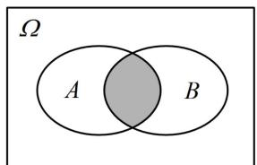
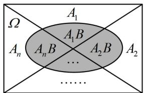
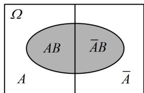

<!-- source-part:1 pages:1-10 -->

# 模块三 离散型随机变量及其分布

## 第1节 条件概率公式、全概率公式（★★★）

## 内容提要

本节包含条件概率公式、乘法公式、全概率公式三部分内容，考试的重点是能够用它们去求概率，以及证明一些概率恒等式. 下面先梳理这些公式及有关性质.

1. 条件概率公式：在事件 $A$ 发生的条件下，事件 $B$ 发生的概率 $P(B|A) = \frac{P(AB)}{P(A)}$ 。计算条件概率常用两种方法。

①基于样本空间 $\Omega$ ，分别计算 $P(A)$ 和 $P(AB)$ ，代上述条件概率公式求 $P(B|A)$

②根据条件概率的直观意义，以事件 $A$ 作为新的样本空间，来求事件 $B$ 发生的概率。如图1， $P(B|A)$ 即为在 $A$ 中考虑 $B$ 发生的概率，所以 $P(B|A)$ 等于阴影部分的样本点个数除以事件 $A$ 的样本点个数。

2. 条件概率的性质:

① $P(\Omega \mid A)=1$ ; ② 若 B, C 互斥，则 $P(B \cup C \mid A)=P(B \mid A)+P(C \mid A)$ ; ③ $P(B \mid A)=1-P(\overline{B} \mid A)$ .

3. 乘法公式: $P(AB) = P(A)P(B|A)$ , 这一公式就是条件概率公式的变形. 实际上, $P(AB)$ 也可写成 $P(B)P(A|B)$ , 实际应用时选择 $A$ 还是 $B$ 作为条件, 要看问题中 $P(B|A)$ , $P(A|B)$ 哪个好算, 通常情况下, 已知前面的试验结果, 计算后面试验结果的概率比较好算, 所以我们常选择以前面的试验结果为条件.

4. 全概率公式：设 $A_{1}, A_{2}, \cdots, A_{n}$ 两两互斥， $A_{1} \cup A_{2} \cup \cdots \cup A_{n} = \Omega$ ，且 $P(A_{i}) > 0 (i = 1, 2, \cdots, n)$ ，则对任意的事件 $B \subseteq \Omega$ ，有 $P(B) = \sum_{i=1}^{n} P(A_{i}) P(B | A_{i})$ 。用全概率公式求概率，其本质是将样本空间划分成若干个部分，如图2，在每一部分上分别求事件 $B$ 的概率，再相加，所以找到合适的划分样本空间的方法是解题的关键。若把样本空间 $\Omega$ 按某一事件 $A$ 是否发生来划分，如图3，则可以得出 $P(B) = P(A) P(B | A) + P(\overline{A}) P(B | \overline{A})$ ，这是全概率公式的一种特殊情况。

  
图1

  
图2

  
图3

![[高中/总复习/教辅/一数常规版2026/第12章 概率统计/模块3 离散型随机变量及其分布/第1节 条件概率公式、全概率公式/类型01_公式计算_化简与判断/类型01_公式计算_化简与判断.md]]
![[高中/总复习/教辅/一数常规版2026/第12章 概率统计/模块3 离散型随机变量及其分布/第1节 条件概率公式、全概率公式/类型02_计算条件概率/类型02_计算条件概率.md]]
![[高中/总复习/教辅/一数常规版2026/第12章 概率统计/模块3 离散型随机变量及其分布/第1节 条件概率公式、全概率公式/类型03_用乘法公式求__P_AB__/类型03_用乘法公式求__P_AB__.md]]
![[高中/总复习/教辅/一数常规版2026/第12章 概率统计/模块3 离散型随机变量及其分布/第1节 条件概率公式、全概率公式/类型04_用全概率公式计算概率/类型04_用全概率公式计算概率.md]]
![[高中/总复习/教辅/一数常规版2026/第12章 概率统计/模块3 离散型随机变量及其分布/第1节 条件概率公式、全概率公式/类型05_条件概率_全概率公式综合题/类型05_条件概率_全概率公式综合题.md]]
![[高中/总复习/教辅/一数常规版2026/第12章 概率统计/模块3 离散型随机变量及其分布/第1节 条件概率公式、全概率公式/强化训练/强化训练.md]]
