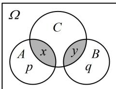

> [!faq]- 《第1节 条件概率公式、全概率公式》例题解析
>
> > [!success]- **【答案】** D
>
> > [!note]- **【分析】**
> > 本题未单列分析。
>
> > [!note]- **【解析】**
> > 解析：A 项，若事件 A, B 独立，则 $P(A \mid B) = \frac{P(AB)}{P(B)} = \frac{P(A)P(B)}{P(B)} = P(A)$ ，故 A 项正确；
> >
> > B项，若事件A，B互斥，则由内容提要第2点的公式②可知B项正确；
> >
> > C 项，由内容提要第 2 点的公式③可知 C 项正确；
> >
> > D项，此项不易通过公式变形来阐释，我们画图来看，
> >
> > 如图，不妨设样本空间中每个样本点发生的可能性相等，
> > 图中 $p = n(A)$ ， $q = n(B)$ ， $x = n(A \cap C)$ ， $y = n(B \cap C)$ ，
> > 则 $P(C \mid (A + B)) = \frac{x + y}{p + q}$ ，而 $P(C \mid A) + P(C \mid B) = \frac{x}{p} + \frac{y}{q}$ ，
> >
> > 
> >
> > 一般而言， $\frac{x+y}{p+q}\neq\frac{x}{p}+\frac{y}{q}$ ，所以 $P(C|(A+B))=P(C|A)+P(C|B)$ 不一定成立，故D项错误.
