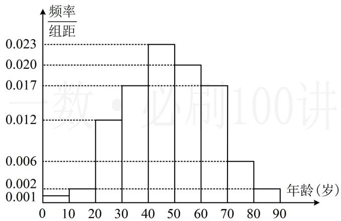

<!-- question-source:start -->
【例 7】(2022·新课标Ⅱ卷) 在某地区进行某种疾病调查, 随机调查了 100 位这种疾病患者的年龄, 得到如下样本数据的频率分布直方图.

（1）估计该地区这种疾病患者的平均年龄；（同一组数据用该区间的中点值作代表）

（2）估计该地区一位这种疾病患者年龄位于区间[20,70)的概率；

（3）已知该地区这种疾病的患病率为 $0.1\%$ ，该地区年龄位于[40,50)的人口数占该地区总人口数的 $16\%$ ，从该地区选出1人，若此人的年龄位于[40,50)，求此人患这种疾病的概率。（精确到0.0001）解：
<!-- question-source:end -->

![[高中/总复习/教辅/一数常规版2026/第12章 概率统计/模块3 离散型随机变量及其分布/第1节 条件概率公式、全概率公式/类型05_条件概率_全概率公式综合题/例题/answers/Q00049691A1.md]]
