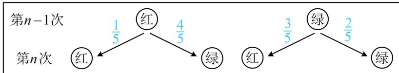

> [!faq]- 《第1节 条件概率公式、全概率公式》例题解析
>
> > [!success]- **【答案】** 详见解析
>
> > [!note]- **【分析】**
> > 本题未单列分析。
>
> > [!note]- **【解析】**
> > 证明： $\left\{P_n - \frac{3}{7}\right\}$ 为等比数列，并求 $P_{n}$
> >
> > 解:
> > (1) $(P_{2}$ 表示第 2 次按下按钮后, 亮红灯的概率, 这一概率受第一次的结果影响, 可按第一次亮红灯、绿灯划分样本空间, 用全概率公式计算)
> >
> > $$
> > A _ {n}
> > $$
> >
> > $$
> > P _ {2} = P (A _ {2}) = P (A _ {1}) P (A _ {2} \mid A _ {1}) + P (\overline {{{{A}}}} _ {1}) P (A _ {2} \mid \overline {{{{A}}}} _ {1}) = \frac {1}{2} \times \frac {1}{5} + \frac {1}{2} \times \frac {3}{5} = \frac {2}{5}
> > $$
> >
> > （2）（应先建立 $\{P_n\}$ 的递推公式，如图，第 $n - 1$ 次的亮灯结果不同，第 $n$ 次亮红灯的概率也不同，故应按第 $n - 1$ 次的亮灯情况划分样本空间，套用全概率公式算 $P_{n}$ ，第 $n - 1$ 次的亮灯情况有 $A_{n - 1}$ 和 $\overline{A}_{n - 1}$ 两种）由全概率公式， $P_{n} = P(A_{n}) = P(A_{n - 1})P(A_{n}|A_{n - 1}) + P(\overline{A}_{n - 1})P(A_{n}|\overline{A}_{n - 1}) = P_{n - 1}\cdot \frac{1}{5} +(1 - P_{n - 1})\cdot \frac{3}{5} = -\frac{2}{5} P_{n - 1} + \frac{3}{5} (n\geq 2)$ ，所以 $P_{n} - \frac{3}{7} = -\frac{2}{5} P_{n - 1} + \frac{3}{5} -\frac{3}{7} = -\frac{2}{5} P_{n - 1} + \frac{6}{35} = -\frac{2}{5}\left(P_{n - 1} - \frac{3}{7}\right)$ ，又 $P_{1} - \frac{3}{7} = \frac{1}{2} -\frac{3}{7} = \frac{1}{14}$ ，所以 $\left\{P_n - \frac{3}{7}\right\}$ 是首项为 $\frac{1}{14}$ ，公比为 $-\frac{2}{5}$ 的等比数列，从而 $P_{n} - \frac{3}{7} = \frac{1}{14}\times \left(-\frac{2}{5}\right)^{n - 1}$ ，故 $P_{n} = \frac{3}{7} +\frac{1}{14}\times \left(-\frac{2}{5}\right)^{n - 1}$ .
> >
> > 
>
> > [!tip]- **【反思】**
> > 这种概率递推问题较新颖，但只要分析清第 $n$ 次和第 $n - 1$ 次的事件联系，即可建立递推公式.
