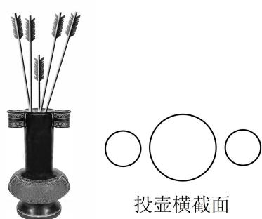

<!-- question-source:start -->
## 5. (2023·重庆三诊·★★★)

投壶是从先秦延续至清末的中国传统礼仪和宴饮游戏，投壶礼来源于射礼。投壶的横截面是三个圆形，投掷者站在距离投壶一定距离的远处将箭羽投向三个圆形的壶口，若箭羽投进三个圆形壶口之一就算投中。为弘扬中华传统文化，某次文化活动进行了投壶比赛，比赛规定投进中间较大圆形壶口得3分，投进左右两个小圆形壶口得1分，没有投进壶口不得分。甲乙两人进行投壶比赛，比赛分为若干轮，每轮每人投一支箭羽，最后将各轮所得分数相加即为该人的比赛得分，比赛得分高的人获胜，已知甲每轮投一支箭羽进入中间大壶口的概率为 $\frac{1}{3}$ ，投进入左右两个小壶口的概率都是 $\frac{1}{6}$ ，乙每轮投一支箭羽进入中间大壶口的概率为 $\frac{1}{4}$ ，投进入左右两个小壶口的概率分别是 $\frac{1}{5}$ 和 $\frac{1}{6}$ ，甲乙两人每轮是否投中相互独立，且两人各轮之间是否投中也互相独立。若在最后一轮比赛前，甲的总分落后乙1分，设甲最后一轮比赛的得分为 $X$ ，乙最后一轮比赛的得分为 $Y$ 。

（1）求甲最后一轮结束后赢得比赛的概率；

(2) 求 $\left|X - Y\right|$ 的数学期望.

<!-- question-source:end -->

![[Q00049718A1]]
