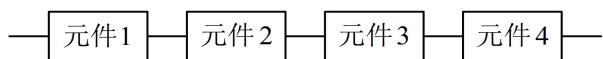

<!-- question-source:start -->
【例 8】某一部件由 4 个电子元件按如图所示的方式连接而成，4 个元件同时正常工作时，该部件正常工作，若有元件损坏，则部件不能正常工作，每个元件损坏的概率为 $p(0 < p < 1)$ ，且各元件能否正常工作相互独立.

(1) 当 $p = 0.2$ 时, 求该部件正常工作的概率;

(2) 使用该部件之前需要对其进行检验, 有以下两种检测方案.

方案甲：将每个元件拆下来，逐个检测其是否损坏，即需要检测4次；

方案乙：先将该部件进行一次检测，如果正常工作则检测停止，若该部件不能正常工作则需逐个检测每个元件.

若每进行一次检测需要花费 $a$ 元，且选择方案乙检测的平均费用更低，求 $p$ 的取值范围.

（1）要使该部件正常工作，则4个元件必须同时正常工作，所以其概率为 $(1 - p)^{4} = (1 - 0.2)^{4} = 0.4096$
（2）（方案乙的检测费用由检测次数决定，检测次数由四个元件是否全部正常工作决定，若是，则只需检测1次，否则需检测5次）

设选择方案乙需要进行的检测次数为 $X$ ，则 $X$ 可能的取值为1，5，

且 $P(X = 1) = (1 - p)^4$ ， $P(X = 5) = 1 - (1 - p)^4$ ，所以 $E(X) = (1 - p)^4 +5[1 - (1 - p)^4 ] = 5 - 4(1 - p)^4$

因为方案乙的检测费用为 $aX$ ，所以期望 $E(aX) = aE(X) = [5 - 4(1 - p)^4 ]a$

又方案甲的检测费用为 $4a$ ，所以 $[5 - 4(1 - p)^4 ]a < 4a$ ，结合 $a > 0$ 和 $0 < p < 1$ 可解得： $0 < p < 1 - \frac{\sqrt{2}}{2}$
<!-- question-source:end -->

![[高中/总复习/教辅/一数常规版2026/第12章 概率统计/模块3 离散型随机变量及其分布/第2节 离散型随机变量的分布列与数字特征/类型05_其它综合类/例题/answers/Q00049713A1.md]]
