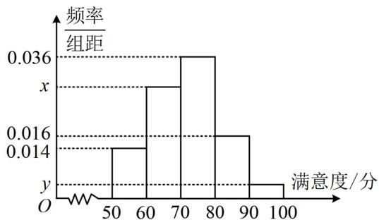

<!-- question-source:start -->
## 5. (2023·四川成都七中模拟·★★★)

随着人民生活水平的不断提高，“衣食住行”愈发被人们所重视，其中对饮食的要求也越来越高。某地区为了解当地餐饮情况，随机抽取了100人对该地区的餐饮情况进行了问卷调查。请根据下面尚未完成并有局部污损的频率分布表和频率分布直方图解决下列问题。

<table><tr><td>组别</td><td>分组</td><td>频数</td><td>频率</td></tr><tr><td>第1组</td><td>[50,60)</td><td>14</td><td>0.14</td></tr><tr><td>第2组</td><td>[60,70)</td><td>m</td><td></td></tr><tr><td>第3组</td><td>[70,80)</td><td>36</td><td>0.36</td></tr><tr><td>第4组</td><td>[80,90)</td><td></td><td>0.16</td></tr><tr><td>第5组</td><td>[90,100]</td><td>4</td><td>n</td></tr></table>

（1）求 $m, n, x, y$ 的值；

(2) 若将满意度在 80 分以上的人群称为 “美食客”, 将频率视为概率, 用样本估计总体, 从该地区中随机抽取 3 人, 记其中 “美食客” 的人数为 $\xi$ , 求 $\xi$ 的分布列和期望.
<!-- question-source:end -->

![[Q00049736A1]]
