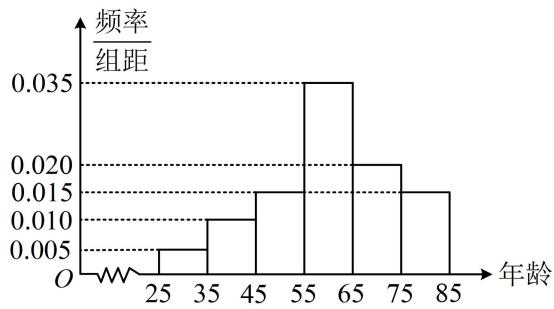

<!-- question-source:start -->
## 6. (2023·青海模拟·★★★)

2021年国庆期间，某县书画协会在县宣传部门的领导下组织了国庆书画展，参展的200幅书画作品反映了该县人民在党的领导下进行国家建设中的艰苦卓绝，这些书画作品的作者的年龄都在[25,85]内，根据统计结果，得到如图所示的频率分布直方图：

（1）求这200位作者年龄的平均数 $\overline{x}$ 和方差 $s^2$ ；（同一组数据用该区间的中点值作代表）

（2）县委宣传部从年龄在[35,45)和[65,75)的作者中，用按比例分配的分层抽样方法抽取6人参加县委组织的表彰大会，现要从6人中选出3人作为代表发言，设这3位发言者的年龄落在区间[35,45)的人数为 $X$ ，求 $X$ 的分布列和数学期望.

## 一数·必刷100讲
<!-- question-source:end -->

![[Q00049737A1]]
