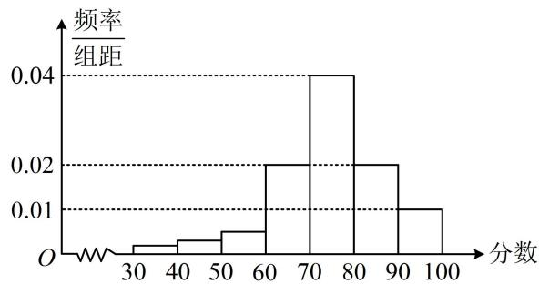

<!-- question-source:start -->
【例 2】某学校高三年级学生参加某项体育测试，根据男女学生人数比例，使用分层抽样的方法从中抽取了 100 名学生，记录他们的分数，将数据分成 7 组：[30,40)，[40,50)，…，[90,100]，整理得到如下的频率分布直方图：

（1）若规定小于60分为“不及格”，从该学校高三年级学生中随机抽取1人，估计该学生不及格的概率；

(2) 若规定分数在[80,90)为“良好”, [90,100]为“优秀”, 用频率估计概率, 从该校高三年级 (总人数较多) 随机抽取3人, 记该项测试分数为“良好”或“优秀”的人数为 $X$ , 求 $X$ 的分布列, 期望和方差.

（1）由图可估计抽到不及格学生的概率为 $1 - 10 \times (0.02 + 0.04 + 0.02 + 0.01) = 0.1$

（2）由图可知从该学校高三年级学生中随机抽1人，抽到“良好”的概率为 $10 \times 0.02 = 0.2$ ，抽到“优秀”的概率为 $10 \times 0.01 = 0.1$ ，所以抽到“良好”或“优秀”的概率为 $0.2 + 0.1 = 0.3$ ，

（由于这3人是从整个高三年级中抽取的，总人数较多，抽取人数远小于总人数，所以每抽取1人后，下次再抽时，抽到“优秀”或“良好”的概率几乎不变，故可按二项分布处理）

由题意， $X\sim B(3,0.3)$ ，所以 $P(X = 0) = \mathrm{C}_3^0\times (1 - 0.3)^3 = 0.343$ ， $P(X = 1) = \mathrm{C}_3^1\times 0.3\times (1 - 0.3)^2 = 0.441$ $P(X = 2) = \mathrm{C}_3^2\times 0.3^2\times (1 - 0.3) = 0.189$ ， $P(X = 3) = \mathrm{C}_3^3\times 0.3^3 = 0.027$ ，故 $X$ 的分布列为：

<table><tr><td>X</td><td>0</td><td>1</td><td>2</td><td>3</td></tr><tr><td>P</td><td>0.343</td><td>0.441</td><td>0.189</td><td>0.027</td></tr></table>

因为 $X \sim B(3,0.3)$ ，所以 $E(X) = 3 \times 0.3 = 0.9$ ， $D(X) = 3 \times 0.3 \times (1 - 0.3) = 0.63$ .

【反思】像这种从某处取几个人，求取到某类个体的个数的分布列这种题，一定要注意是从总体中取，还是从个体数较少的样本中取。若是前者，由于抽取的人数往往远小于总人数，所以常按二项分布处理；而后者，则按超几何分布来求分布列。
<!-- question-source:end -->

![[高中/总复习/教辅/一数常规版2026/第12章 概率统计/模块3 离散型随机变量及其分布/第3节 二项分布与超几何分布/类型02_二项分布综合题/例题/answers/Q00049725A1.md]]
