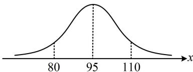

> [!faq]- 《第4节 正态分布》参考答案
>
> > [!success]- **【答案】** B
>
> > [!note]- **【分析】**
> > 本题未单列分析。
>
> > [!note]- **【解析】**
> > B
> >
> > 解析：涉及正态分布的区间概率，考虑画正态曲线来看，由题意，成绩在80分以下的概率 $P(X < 80) = \frac{1500}{8000} = \frac{3}{16}$ ，如图，由对称性， $P(X > 110) = P(X < 80) = \frac{3}{16}$ ，所以 $P(95 \leq X \leq 110) = \frac{1}{2} - P(X > 110) = \frac{1}{2} - \frac{3}{16} = \frac{5}{16}$ .
> >
> > 
