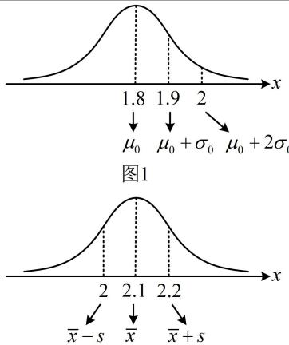

> [!faq]- 《第4节 正态分布》参考答案
>
> > [!success]- **【答案】** BC
>
> > [!note]- **【分析】**
> > 本题未单列分析。
>
> > [!note]- **【解析】**
> > 解析：涉及正态分布区间取值概率，可画正态曲线来看，由题意， $X\sim N(1.8,0.1^2)$ ，所以 $X$ 的均值为 $\mu_0 = 1.8$ 标准差为 $\sigma_0 = 0.1$ ，故随机变量 $X$ 的正态曲线如图1，由图可知， $P(X > 2) <   P(X > 1.9) = 1 - P(X <   1.9)$ $= 1 - P(X <   \mu_0 + \sigma_0)\approx 1 - 0.8413 = 0.1587 <   0.2$
> >
> > 故A项错误，B项正确；
> >
> > 又 $Y \sim N(\overline{x}, s^2)$ ， $\overline{x} = 2.1$ ， $s^2 = 0.01$ ，所以 $Y$ 的正态曲线如图2，由图形的对称性可知， $P(Y > 2) = P(Y < 2.2) = P(Y < \overline{x} + s) \approx 0.8413$ ，故C项正确，D项错误.
> >
> >   
> > 图2
