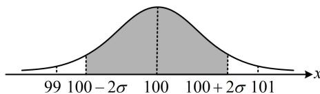

> [!faq]- 《第4节 正态分布》参考答案
>
> > [!success]- **【答案】** $\frac{1}{2}$
>
> > [!note]- **【分析】**
> > 本题未单列分析。
>
> > [!note]- **【解析】**
> > 解析：注意到 $95.45\%$ 恰好是 $P(|X - \mu| < 2\sigma)$ ，故先把本题的 $\mu$ 代入此不等式，由所给数据， $P(|X - \mu| < 2\sigma) = P(-2\sigma < X - \mu < 2\sigma)$ $= P(\mu - 2\sigma < X < \mu + 2\sigma) = 0.9545$ ①，本题中，质量指标服从正态分布 $N(100, \sigma^2) \Rightarrow \mu = 100$ ，代入①得： $P(100 - 2\sigma < X < 100 + 2\sigma) = 0.9545$ 如图，故要使良品率达到 $95.45\%$ ，即 $P(99 < X < 101) \geq 95.45\%$ ，此时 (99,101) 应包含 $(100 - 2\sigma, 100 + 2\sigma)$ ，所以 $\left\{ \begin{array}{l} 100 + 2\sigma \leq 101 \\ 100 - 2\sigma \geq 99 \end{array} \right.$ ，解得： $\sigma \leq \frac{1}{2}$ ，所以 $\sigma$ 至多为 $\frac{1}{2}$ .
> >
> > 
