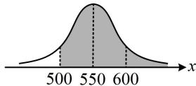

> [!faq]- 《第4节 正态分布》参考答案
>
> > [!success]- **【答案】** D
>
> > [!note]- **【分析】**
> > 本题未单列分析。
>
> > [!note]- **【解析】**
> > 解析：应先分析 $p$ 为何值时，100辆汽车中恰有80辆达到标准的概率取得最大值，由题意，100辆汽车中达到标准的汽车辆数服从二项分布 $B(100,p)$ ，所以恰有80辆达到标准的概率为 $\mathrm{C}_{100}^{80}p^{80}(1 - p)^{20}$ 此式较复杂，可构造函数求导分析最大值，
> >
> > 设 $f(p) = \mathrm{C}_{100}^{80}p^{80}(1 - p)^{20}(0 <   p <   1)$ ，
> >
> > $$
> > f ^ {\prime} (p) = \mathrm{C} _ {1 0 0} ^ {8 0} [ 8 0 p ^ {7 9} (1 - p) ^ {2 0} - p ^ {8 0} \cdot 2 0 (1 - p) ^ {1 9} ]
> > $$
> >
> > $$
> > = \mathrm{C} _ {1 0 0} ^ {8 0} p ^ {7 9} (1 - p) ^ {1 9} (8 0 - 1 0 0 p)
> > $$
> >
> > 所以 $f'(p)>0\Leftrightarrow0<p<0.8$ ， $f'(p)<0\Leftrightarrow0.8<p<1$ ，
> >
> > 从而 $f(p)$ 在 $(0,0.8)$ 上 $\nearrow$ ，在 $(0.8,1)$ 上 $\searrow$ ，故当 100 辆汽车中恰有 80 辆达到标准的概率取最大值时， $p = 0.8$ ，达到标准即最大续航里程不低于 500 公里，这一结果可翻译成 $X$ 的取值概率，由题意， $P(X \geq 500) = 0.8$ ，
> >
> > 在此基础上求 $P(X \geq 600)$ ，可画正态曲线来看，如图，
> >
> > $$
> > P (X \geq 6 0 0) = P (X \leq 5 0 0) = 1 - P (X \geq 5 0 0) = 1 - 0. 8 = 0. 2.
> > $$
> >
> > 
