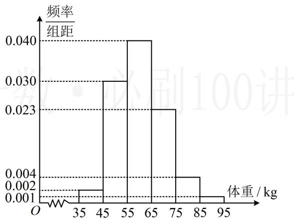

> [!faq]- 《第4节 正态分布》参考答案
>
> > [!success]- **【答案】** 详见解析
>
> > [!note]- **【分析】**
> > 本题未单列分析。
>
> > [!note]- **【解析】**
> > ## 5. (2023·安徽模拟·★★★)
> >
> > 为贯彻落实《健康中国行动（2019\~2030年）》、《关于全面加强和改进新时代学校体育工作的意见》等文件的精神，确保2030年学生体质达到规定要求，各地将认真做好学生的体质健康检测。某市决定对某中学学生的身体健康状况进行调查，现从该校抽取200名学生测量他们的体重，得到如下的样本数据的频率分布直方图。
> >
> > 
> >
> > (1) 求这 200 名学生体重的平均数 $\overline{x}$ 和方差 $s^2$ ; (同一组数据用该区间的中点值作代表)
> >
> > （2）由频率分布直方图可知，该校学生的体重 $Z$ 服从正态分布 $N(\mu, \sigma^2)$ ，其中 $\mu$ 近似为样本平均数 $\bar{x}$ ， $\sigma^2$ 近似为样本方差 $s^2$ 。
> > - **①**：利用该正态分布，求 $P(50.73 < Z \leq 69.27)$ ；
> > - **②**：若从该校随机抽取50名学生，记 $X$ 表示这50名学生的体重位于区间(50.73,69.27]内的人数，利用①的结果，求 $E(X)$ ：
> >
> > 参考数据： $\sqrt{86} \approx 9.27$ ，若 $Z \sim N(\mu, \sigma^2)$ ，则 $P(\mu - \sigma < Z \leq \mu + \sigma) \approx 0.6827$ ， $P(\mu - 2\sigma < Z \leq \mu + 2\sigma) \approx 0.9545$ ， $P(\mu - 3\sigma < Z \leq \mu + 3\sigma) \approx 0.9973$
